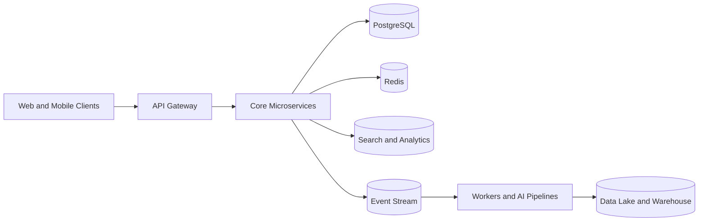

# System Overview

## High-Level Architecture

## Design Goals

- Reliable APIs for daily growth operations.
- Scalable asynchronous processing for crawlers and AI workloads.
- Clear boundaries between transactional and analytical systems.
