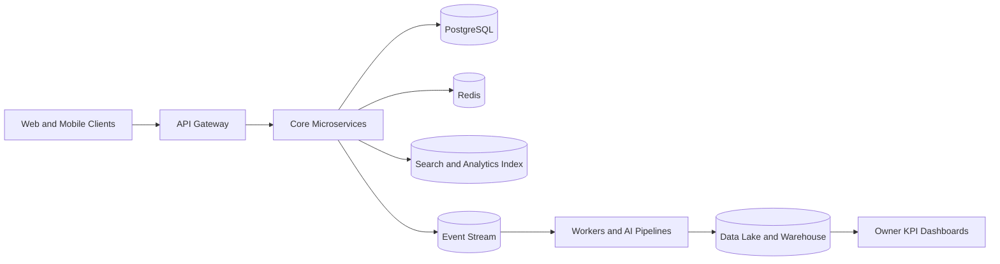

# System Overview

## Scale Goal

The architecture is designed to evolve toward **1M users** while maintaining reliability, observability, and cost discipline.

## High-Level Architecture

## Core Workload Groups

- Synchronous APIs for user-facing workflows.
- Asynchronous workers for crawling, ranking updates, AI generation, and optimization jobs.
- Analytical pipelines for reporting and model features.

## Reliability Targets

- API availability `99.9%`
- clear rollback strategy for deployments,
- incident playbooks by severity,
- cost and performance monitoring by service domain.
