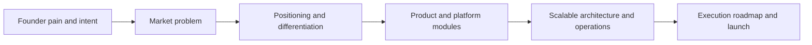

# GrowthSO Documentation

GrowthSO is an AI Growth Operating System built to help businesses run SEO and digital marketing as one coordinated machine, not separate tools.

## Document Version

- Version: `2.0.0`
- Status: `Presentation-ready and production-oriented`
- Last updated: `2026-03-15`

## Founder Intent (Validated from Shared Ideation)

GrowthSO is designed as a **web + mobile platform** to:

- automate SEO and marketing execution,
- optimize paid budget and improve ROI,
- push target domains toward top search visibility,
- increase positive reviews and reduce unresolved negative review impact,
- make advanced growth operations accessible to non-experts.

## Start Here by Role

- Production owner: [Executive Brief](owner/executive-brief.md) -> [Presentation Narrative](owner/presentation-narrative.md)
- Product lead: [Product Vision](product/product-vision.md) -> [Product Strategy & Differentiation](product/product-strategy-and-differentiation.md)
- Engineering lead: [System Overview](architecture/system-overview.md) -> [90-Day MVP Execution Plan](roadmap/90-day-mvp-execution-plan.md)
- GTM/sales: [Why We Are Building This](story/why-we-are-building-this.md) -> [Competitive Landscape](reference/competitive-landscape.md)

## Story Path

## Definition of “Presentation-Ready”

- Clear business narrative for non-technical stakeholders.
- Concrete product scope and differentiation.
- Credible architecture for scale to 1M users.
- Measurable roadmap tied to business outcomes.
