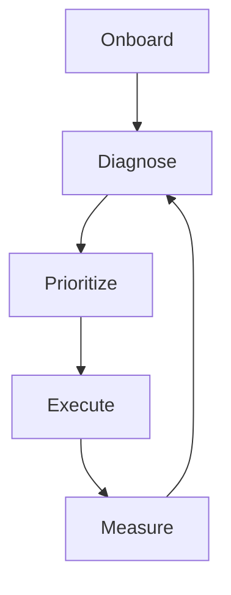

# Personas & Journey

## Core Personas

- Production Owner: needs predictable ROI and clear reporting.
- Growth Operator: needs recommendations and fast execution tools.
- Content Manager: needs SEO-ready content plans and publishing flow.
- Performance Marketer: needs budget optimization and channel visibility.

## End-to-End Journey

1. Onboard domain and business profile.
2. Run baseline scan across SEO, content, ads, and reviews.
3. Prioritize actions by impact and effort.
4. Execute manually or via approved automation.
5. Measure outcome and retrain decision loops.

